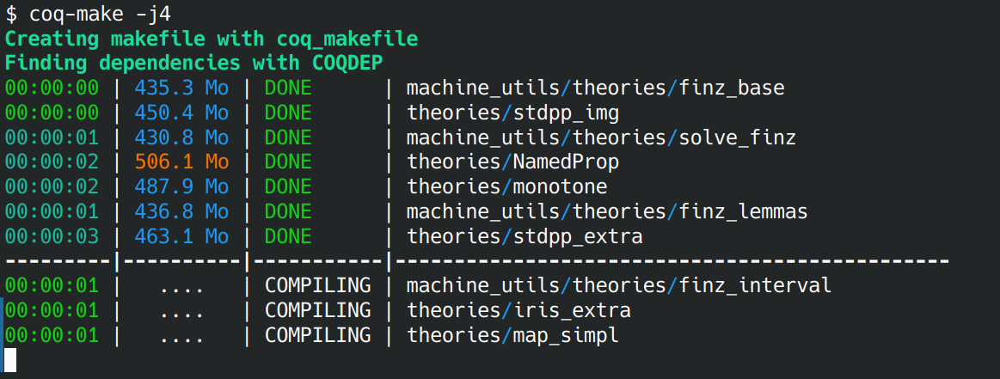
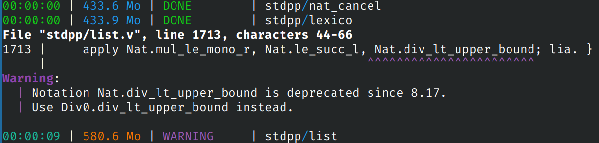

<!-- LTeX: language=en -->

# Coq prettier makefile

[](./coqprettiermakefile.opam)
[](https://github.com/dlesbre/coq-prettier-makefile/actions)
[](./LICENSE)

This is a simple utility script to render a prettier output when compiling large
Coq projects. It prints a nice aligned output with color coded build times and memory usages :



Also prettifies error message by adding color and showing the relevant
file location:



## Installation

This package requires ANSITerminal to build:

```console
opam install ANSITerminal
```

To install simply clone this repository and build with `dune`:

```console
git clone git@github.com:dlesbre/coq
cd coq-prettier-makefile
dune build
dune install
```

## Usage

To use simply call `coq-make` where you would usually call `make`. It will
internally call the makefile, and parse its output to render the display. This
should work even if you use a wrapper makefile around the standard coq_makefile.

Any flag arguments are forwarded to `make`, so you can call `coq-make -j4` with
the expected result. For non flag arguments `coq-make` will try to be smart. If
it looks like a file appearing in the `_CoqProject`, it will call `make
full/file/name.vo`, otherwise it will pass the argument as usual. This
allows typing `coq-make file` instead of the lengthier `coq-make
path/to/file.vo`

## Alternatives

This script is a bit of a hack around Coq's makefile, and is in no way a proper
build system. As some helpful people have pointed out on the [Zulip
discussion](https://coq.zulipchat.com/#narrow/stream/237655-Miscellaneous/topic/Script.20to.20prettify.20output.20of.20Coq.20makefiles/),
[dune](https://dune.readthedocs.io/en/stable/coq.html#introduction) can build
coq projects. It also has a pretty nice, non-cluttered output by default, and
can print files as they are compiled when using the `--display short` option. It
doesn't display build times/memory usage yet, but it will undoubtedly be better
maintained than this tool. I would consider switching your build system to it if possible,
and using this for large legacy projects that can't or won't make the switch.
